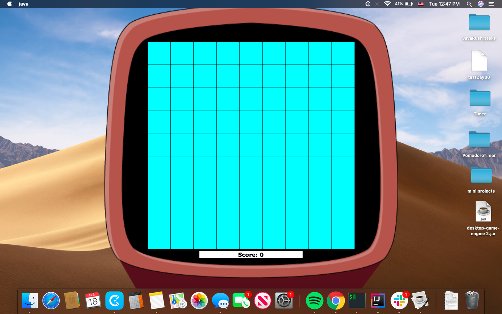
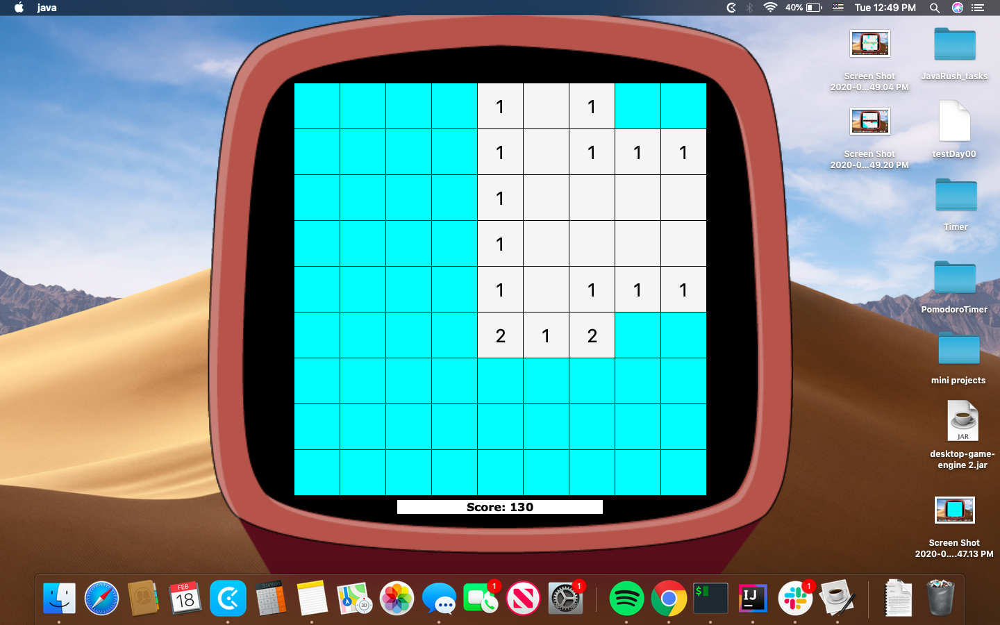
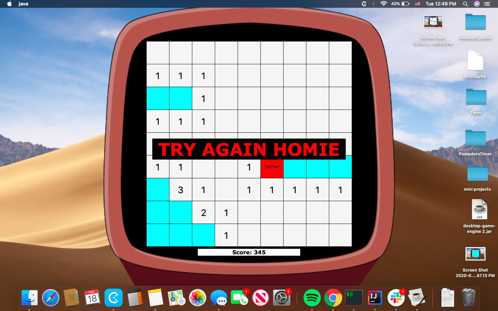
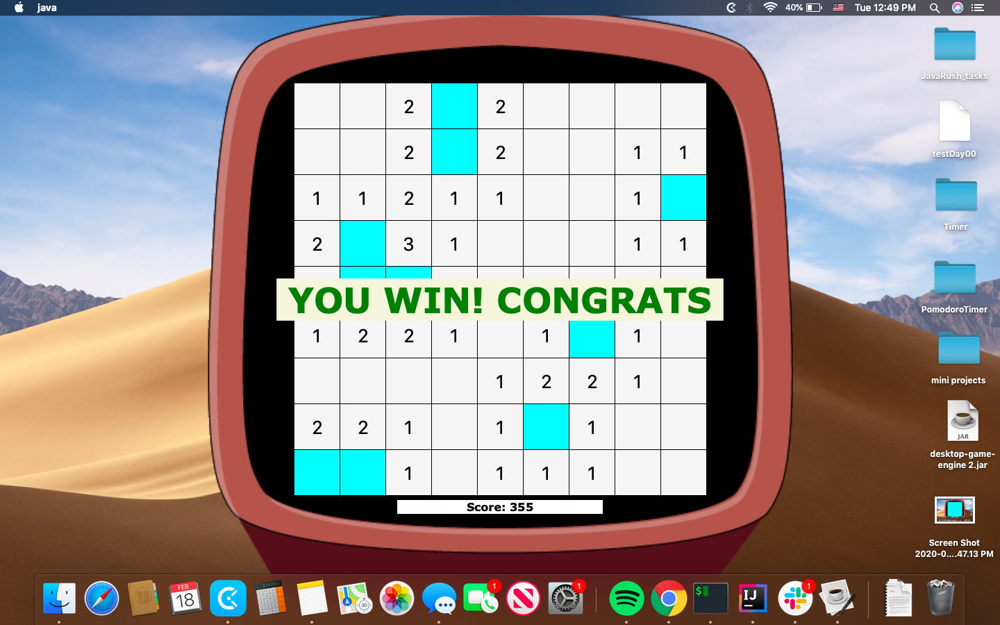

# Minesweeper
My implementation of the famous office game. Game on!

Hello dear gamer!

This is a very famous game that doen't need represantation.

In my implementation you can Create your field as big as you want with the little modifications in code(change the value of variable 'SIDE'). You can also use and remove flags just like in original game.
To add more fun to the game - I also implemented score. Every time you open a non-mine cell - you'll earn 5 points.
Good luck and sweep carefully :)

Here are some screenshots of the game while running.

